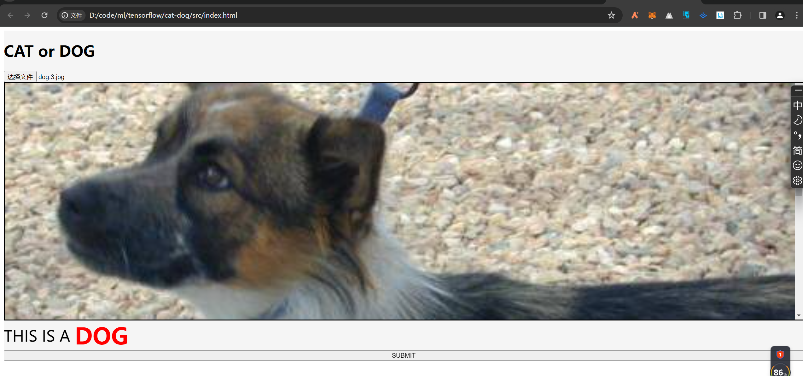
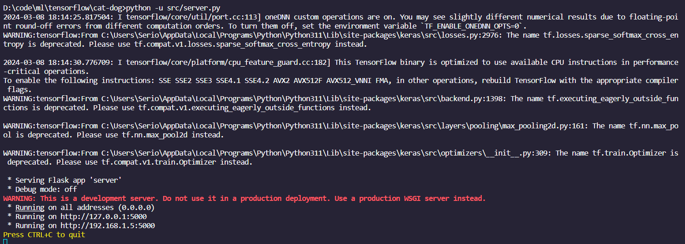

# 前后端分离的猫狗分类

## 前言

这个项目是我的一个练手作品，使用的是 CNN 架构中的 VGG-like 模型，也就是一种轻量化的 VGG——只有三层卷积。

在我完成这个仓库的前几天，我试着去投递一些大企业的前端+计算机视觉算法岗位，但是很不幸的是我的能力没有达到他们的要求，我感到非常沮丧。

有朋友告诉我，他们可能更想招的是做视觉算法转岗前端的硕士，而不是一个前端跨行做视觉算法的本科生。

很感谢朋友的劝勉，但至少两三年内，我应该不会再投递相关的岗位了，毕竟自己还是太差劲了，现在的技术水平可能还不如发达地区的小学生呢，别人哪敢随便让我一个半路出家的上生产环境呀。

不过我并不打算就此放弃，我相信 AI 一定是未来。

我失败了这么多年，这一次，我一定要牢牢地把未来抓在我手里。

## 文件结构

文件结构非常简单：

- `models`: 训练好的模型，其文件名形如 `tra(x)-val(y).keras`, 其中x代表训练集上的准确率，y代表测试集上的准确率。

- `src`: 源码文件，包含前端代码、模型训练代码、服务器代码。


## 启动项目

- 前端：`src/index.html` 双击打开即可。



- 服务端：`src/server.py`，使用如下命令即可启动：

```sh
cd web-cat-dog-classification # 进入项目根目录
python -u src/server.py
```

项目成功启动则可看到如下信息：




## LICENSE

MIT